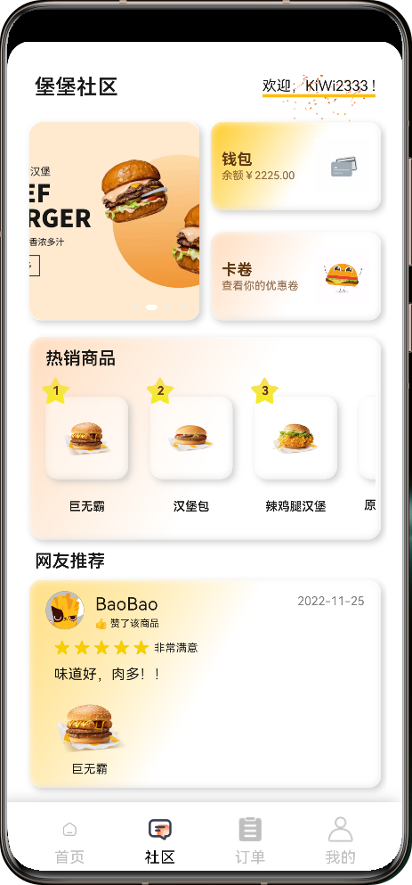

 

 

 <h1 align=center style="margin: 10px 0;">Hamburger Harmony APP</h1>

  
  

  
  
  

 

## 项目介绍

项目基于鸿蒙系统，使用 Js 语言开发，实现了 Hamburger Harmony APP 外卖的点餐功能。用户可以通过该应用浏览菜单、选择菜品、添加到购物车，并完成下单支付。项目使用鸿蒙系统提供的 UI 组件和 API。 

## 效果展示

## 联系作者：

- Email: kiwi2333@qq.com 
- QQ: 1329634286
